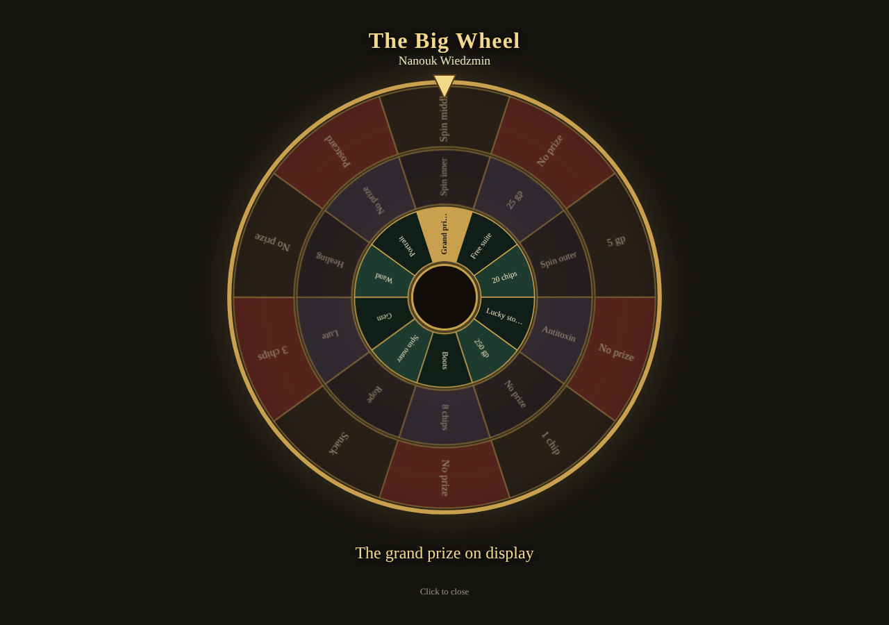

# Planar Casino

A casino night for **Foundry VTT v14** and the **dnd5e** system (6.x): casino chips as an inventory item, cages to buy and cash them, slot machines, a three-ring prize wheel, two table games with NPC rivals who play too, and a per-night ledger ready for your session log.

The module is an engine. Everything the players see (the casino's name, the chip's name, slot symbols and prizes, the wheel's thirty segments, the rivals, the hourly events, private whispers) comes from a **JSON pack** you import. A small generic pack ships with the module so it works out of the box; you can write your own to match the casino in your adventure.



## Features

- **Chips as an item.** A stackable dnd5e *loot* item recognised by a flag (rename it freely). It sits in the inventory, can be handed over or pickpocketed, and a counter appears next to the coins on the character sheet.
- **Cages.** Buy chips with gold (the system makes change from other coins) and cash them back. A welcome gift for every PC, once. The GM can open and close the cages.
- **Slots.** Three d6 mapped to six symbols: a pair pays the symbol's pair prize; three of a kind pays its jackpot, once per world; a special combination grants a reroll on the next pull, chosen by the player on their own screen.
- **Prize wheel.** Three concentric rings of ten segments each; "spin again" segments chain between rings. One spin per creature per N hours of world time (or per night). Once-only prizes. A full-screen animated wheel plays for everyone.
- **Bones table.** Each player secretly picks how many d6 to shake and how much to stake; everyone reveals at once; highest total wins the pot, anyone who rolls a 1 is out.
- **Number board.** Players put chips on 1–20 on a clickable board; the dealer rolls a d20; chips on the number pay ×N.
- **Rivals.** NPC gamblers with a bankroll and a style (how many dice, how many numbers, how much they wager, favourite numbers). They take seats at the tables and play by themselves; they can go broke.
- **Prizes that land on the sheet.** Gold, chips, temporary hit points, damage (resistances apply), items found by name in the world and then in every Item compendium (imports from other tools included), spell scrolls made from a spell. Anything that can't be found gets a **Grant** button for the GM.
- **Ledger.** Every chip bought, cashed, wagered, won, gifted, stolen or changed by hand, per casino night, as a Markdown table on a journal page (a Planar Codex note when that module is installed, so it exports to your vault).
- **For the GM only:** a "heat" warning when a PC keeps winning at one game, an hour-by-hour clock with your events, private whispers when a given character plays a given game, and optional Planar Soundboard pads for spins, jackpots, wins and losses.
- **From chat:** `/chips`, `/slots`, `/wheel`, `/cage buy 5`, `/cage cash 5`, `/casino`.
- English and Greek interface.

The module ships no publisher content: no adventure text, art or audio.

## Install

In Foundry: **Add-on Modules → Install Module**, paste this manifest URL and press Install:

```
https://github.com/zacharatos/planar-casino/releases/latest/download/module.json
```

Enable **Planar Casino** in your world (Game Settings → Manage Modules). It needs the **dnd5e** system.

## Use

1. **Load your pack.** GM: the wheel icon in the Tokens toolbar opens the panel. **Pack → Import pack** and pick your `.json` file. (See *Writing a pack* below.)
2. **Open a night.** **Floor → Open night**, give it a name (e.g. *Session 03 — Casino*). The ledger records what each PC holds now. (If you forget, the first chip movement opens one for you.)
3. **Let the players in.** Tick **Floor open to players**: they get the wheel icon in their toolbar and a casino window with their chips, the cage, the slots and the wheel. Press **Welcome gift** once.
4. **Tables.** **Tables**: pick the game, the ante, who sits (PCs and rivals) and **Open table**. Each seated player sees the betting controls in their window. When everyone is in, press **Roll**. The table stays open for the next round.
5. **Hours.** **Next hour** whispers you the pack's event for that hour.
6. **Close the night.** **Close night**. The ledger page is up to date; **Ledger → Copy Markdown** puts it on your clipboard.

Chips taken by a pickpocket: **Floor → Adjust → Stolen**. A rival handing out a chip: **Rivals → give 1 chip**. The one-off platinum chip: **Floor → Platinum chip**.

## Writing a pack

A pack is one JSON file. The shipped generic pack, [`data/default-pack.json`](data/default-pack.json), is a complete example. The shape:

```jsonc
{
  "planarCasinoPack": 1,            // schema version
  "id": "my-casino",
  "name": "…", "description": "…",
  "casino": { "name": "…", "razorName": "chip name", "razorValue": 10, "welcomeGift": 10, "platinumName": "…" },
  "slots": {
    "cost": 1, "machine": "…",
    "symbols": [ /* exactly 6, for d6 faces 1–6 */
      { "label": "Bell", "icon": "🔔", "pair": PRIZE, "jackpot": PRIZE }
    ],
    "special": { "faces": [2, 4, 6], "label": "…", "text": "…" }   // any order → reroll next pull
  },
  "wheel": {
    "name": "…", "cost": 5, "cooldownHours": 24, "maxSteps": 10,
    "rings": {                       // exactly 10 entries each, for d10 1–10
      "outer":  [ { "label": "…", "prize": PRIZE } | { "label": "…", "goto": "middle" } … ],
      "middle": [ … ], "inner": [ … ]
    }                                // add "once": true to an entry that can be won only once
  },
  "bones": { "name": "…", "ante": 1, "dealer": { "name": "…", "bones": 3 } },
  "board": { "name": "…", "multiplier": 5, "dealer": { "name": "…" } },
  "rivals": [ { "id": "…", "name": "…", "img": "path.webp", "bankroll": 30, "bones": [2, 4], "numbers": 2, "wager": 1, "favorites": [7], "notes": "…" } ],
  "timedEvents": [ { "hour": 1, "title": "…", "text": "…" } ],
  "triggers": [ { "id": "…", "actor": "Character name (or first word)", "game": "wheel", "to": "player|gm", "once": true, "text": "HTML" } ]
}
```

A **PRIZE** is one of:

| `type` | Fields | Effect |
| --- | --- | --- |
| `gp` | `amount` or `formula` | adds gold |
| `razors` | `amount` or `formula` | adds chips (counts as a win) |
| `tempHp` | `formula` | temporary hit points |
| `damage` | `formula`, `damageType` | damage, resistances apply |
| `item` | `item` (name) or `uuid`, optional `quantity` | finds the item and adds it |
| `scroll` | `spell` (name) or `uuid` | a spell scroll of that spell |
| `platinum` | | the platinum chip |
| `note` | optional `formula` | just text |

Every prize has a `label`; `{n}` in the label is replaced by the rolled amount.

## Settings

| Setting | |
| --- | --- |
| Grant item prizes automatically | Off: every item prize waits for the GM's Grant button. |
| Heat | Wins at one game in one night before the GM is warned (0 = off). |
| Wheel cooldown uses world time | Off: one spin per creature per casino night. |
| Soundboard pads | Names of Planar Soundboard pads for spin, jackpot, win and loss. |
| Show the wheel animation | Per player. |

## Macro API

```js
const casino = game.modules.get("planar-casino").api;
casino.open();                      // GM panel
casino.openPlayer();                // player window
casino.razors(actor);               // chips held
await casino.slots(actorId);
await casino.wheel(actorId);
await casino.cage(actorId, "buy", 5);
await casino.adjust(actorId, -2, "stolen", "pickpocket");
```

## Development

See [`docs/DEVELOPMENT.md`](docs/DEVELOPMENT.md) for the file map, the checks (`npm test`) and the manual test checklist, and [`docs/PUBLISHING.md`](docs/PUBLISHING.md) for releases.

## License

MIT, see [LICENSE](LICENSE).
